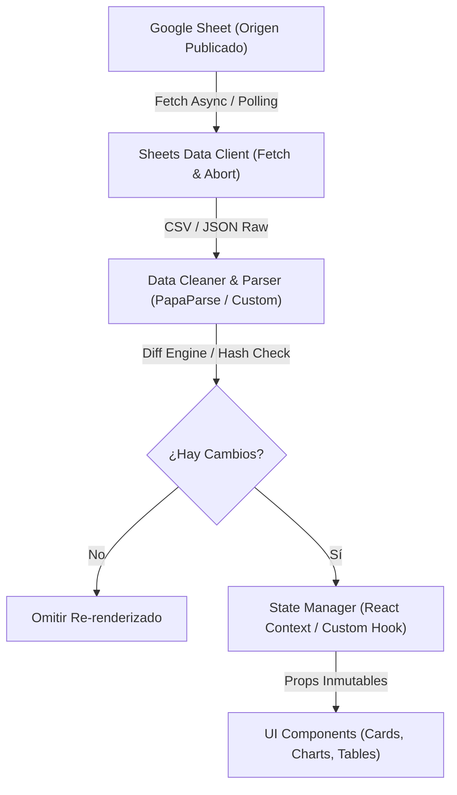

# 🏗️ Arquitectura Técnica y Flujo de Datos

## 📐 Visión General de Arquitectura

El sistema opera mediante una arquitectura orientada a cliente (Client-Side Reactive Data Pipeline) con capacidades de sincronización continua.

---

## 🔄 Flujo de Sincronización en Tiempo Real

1. **Ciclo de Polling Resiliente:**
   - La aplicación inicia un temporizador mediante custom hook `useSheetsPolling`.
   - Cada ciclo emite un `fetch` a la URL configurada adjuntando encabezados de prevención de caché (`Cache-Control: no-cache`).

2. **Cálculo de Hash y Diffing:**
   - Al recibir la respuesta, se calcula un digest ligero (hash o string hash).
   - Se compara con `lastHashRef.current`.
   - Si no hay mutaciones en los valores crudos, se omite el procesamiento pesado.

3. **Reconciliación Visual:**
   - Si hay cambios, se ejecuta el sanitizador y los componentes de visualización actualizan sus datos usando transiciones CSS / animaciones de gráficos.
